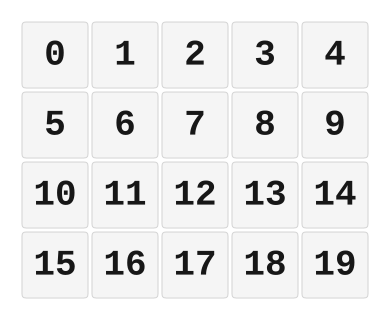

# ZMK Configuration for ButtonBox

*Generated by Shield Wizard for ZMK*



Download compiled firmware from the Actions tab. <https://zmk.dev/docs/user-setup#installing-the-firmware>

Edit your keymap <https://zmk.dev/docs/keymaps>.
User keymap is located at [`config/buttonbox.keymap`](config/buttonbox.keymap).

-----

<details>
<summary>
Shield Wizard Debug Information
</summary>

In case of broken configuration, here is the Shield Wizard internal data used to generate this configuration:

Commit: 5840d41ac0915092c8fe45da617ffb4bb91e1b97

```json
{"name":"ButtonBox","shield":"buttonbox","dongle":false,"modules":[],"layout":[{"id":"01KNTFA0N47EC143EMR7SSJXT2","part":0,"row":0,"col":0,"w":1,"h":1,"x":1,"y":0,"r":0,"rx":0,"ry":0},{"id":"01KNTFA0TPJXB5G61DVWZT20YX","part":0,"row":0,"col":1,"w":1,"h":1,"x":2,"y":0,"r":0,"rx":0,"ry":0},{"id":"01KNTFA10MDMX201Y13HF1THGZ","part":0,"row":0,"col":2,"w":1,"h":1,"x":3,"y":0,"r":0,"rx":0,"ry":0},{"id":"01KNTFA16K4B1GSMS0F85H4WFC","part":0,"row":0,"col":3,"w":1,"h":1,"x":4,"y":0,"r":0,"rx":0,"ry":0},{"id":"01KNTFA1C4NENHQ07MNFD3GF2X","part":0,"row":0,"col":4,"w":1,"h":1,"x":5,"y":0,"r":0,"rx":0,"ry":0},{"id":"01KNTFA1HV0R8T0PDGDY6F03S4","part":0,"row":1,"col":0,"w":1,"h":1,"x":1,"y":1,"r":0,"rx":0,"ry":0},{"id":"01KNTFA1QV2BHGN8C8Y0M6PWBK","part":0,"row":1,"col":1,"w":1,"h":1,"x":2,"y":1,"r":0,"rx":0,"ry":0},{"id":"01KNTFA1XC4RHC2B57X45WJFMN","part":0,"row":1,"col":2,"w":1,"h":1,"x":3,"y":1,"r":0,"rx":0,"ry":0},{"id":"01KNTFA22XMM2YZ23BFQTT8ZGZ","part":0,"row":1,"col":3,"w":1,"h":1,"x":4,"y":1,"r":0,"rx":0,"ry":0},{"id":"01KNTFA28E6VTDCTAECKYZ2A8H","part":0,"row":1,"col":4,"w":1,"h":1,"x":5,"y":1,"r":0,"rx":0,"ry":0},{"id":"01KNTFA2DGMBYYY8BPX8A99E9J","part":0,"row":2,"col":0,"w":1,"h":1,"x":1,"y":2,"r":0,"rx":0,"ry":0},{"id":"01KNTFA2K15RMZKRM2YPNSANVY","part":0,"row":2,"col":1,"w":1,"h":1,"x":2,"y":2,"r":0,"rx":0,"ry":0},{"id":"01KNTFA2RMJ122YFARXVX5C4AD","part":0,"row":2,"col":2,"w":1,"h":1,"x":3,"y":2,"r":0,"rx":0,"ry":0},{"id":"01KNTFA2Y2KY0Z81N3DJRHWARN","part":0,"row":2,"col":3,"w":1,"h":1,"x":4,"y":2,"r":0,"rx":0,"ry":0},{"id":"01KNTFA33KEFEYKC5Q7KPFSDM3","part":0,"row":2,"col":4,"w":1,"h":1,"x":5,"y":2,"r":0,"rx":0,"ry":0},{"id":"01KNTFA397YZ5ZQN3AQCSY5G34","part":0,"row":3,"col":0,"w":1,"h":1,"x":1,"y":3,"r":0,"rx":0,"ry":0},{"id":"01KNTFA3RR10KJKBNGQGPJ5556","part":0,"row":3,"col":1,"w":1,"h":1,"x":2,"y":3,"r":0,"rx":0,"ry":0},{"id":"01KNTFA4BKGFFD5JPF1N4NN4X0","part":0,"row":3,"col":2,"w":1,"h":1,"x":3,"y":3,"r":0,"rx":0,"ry":0},{"id":"01KNTFA4HT9SPSG9WEA2XRMBX8","part":0,"row":3,"col":3,"w":1,"h":1,"x":4,"y":3,"r":0,"rx":0,"ry":0},{"id":"01KNTFA4QE5M3P04W89PVYJCJS","part":0,"row":3,"col":4,"w":1,"h":1,"x":5,"y":3,"r":0,"rx":0,"ry":0}],"parts":[{"name":"buttonbox","controller":"nice_nano_v2","wiring":"direct_gnd","pins":{"d1":"input","d0":"input","d2":"input","d3":"input","d4":"input","d5":"input","d6":"input","d7":"input","d8":"input","d9":"input","p101":"input","p102":"input","d10":"input","d16":"input","d14":"input","d15":"input","d18":"input","d19":"input","d20":"input","d21":"input"},"keys":{"01KNTFA0N47EC143EMR7SSJXT2":{"input":"d1"},"01KNTFA0TPJXB5G61DVWZT20YX":{"input":"d0"},"01KNTFA10MDMX201Y13HF1THGZ":{"input":"d2"},"01KNTFA16K4B1GSMS0F85H4WFC":{"input":"d21"},"01KNTFA1C4NENHQ07MNFD3GF2X":{"input":"d20"},"01KNTFA1HV0R8T0PDGDY6F03S4":{"input":"d3"},"01KNTFA1QV2BHGN8C8Y0M6PWBK":{"input":"d4"},"01KNTFA1XC4RHC2B57X45WJFMN":{"input":"d5"},"01KNTFA22XMM2YZ23BFQTT8ZGZ":{"input":"d19"},"01KNTFA28E6VTDCTAECKYZ2A8H":{"input":"d18"},"01KNTFA2DGMBYYY8BPX8A99E9J":{"input":"d6"},"01KNTFA2K15RMZKRM2YPNSANVY":{"input":"d7"},"01KNTFA2RMJ122YFARXVX5C4AD":{"input":"d8"},"01KNTFA2Y2KY0Z81N3DJRHWARN":{"input":"d15"},"01KNTFA33KEFEYKC5Q7KPFSDM3":{"input":"d14"},"01KNTFA397YZ5ZQN3AQCSY5G34":{"input":"d9"},"01KNTFA3RR10KJKBNGQGPJ5556":{"input":"p101"},"01KNTFA4BKGFFD5JPF1N4NN4X0":{"input":"p102"},"01KNTFA4HT9SPSG9WEA2XRMBX8":{"input":"d16"},"01KNTFA4QE5M3P04W89PVYJCJS":{"input":"d10"}},"encoders":[],"buses":[{"name":"spi0","devices":[],"type":"spi"},{"name":"spi1","devices":[],"type":"spi"},{"name":"spi2","devices":[],"type":"spi"},{"name":"spi3","devices":[],"type":"spi"},{"name":"i2c0","devices":[],"type":"i2c"},{"name":"i2c1","devices":[],"type":"i2c"}]}]}
```

</details>
